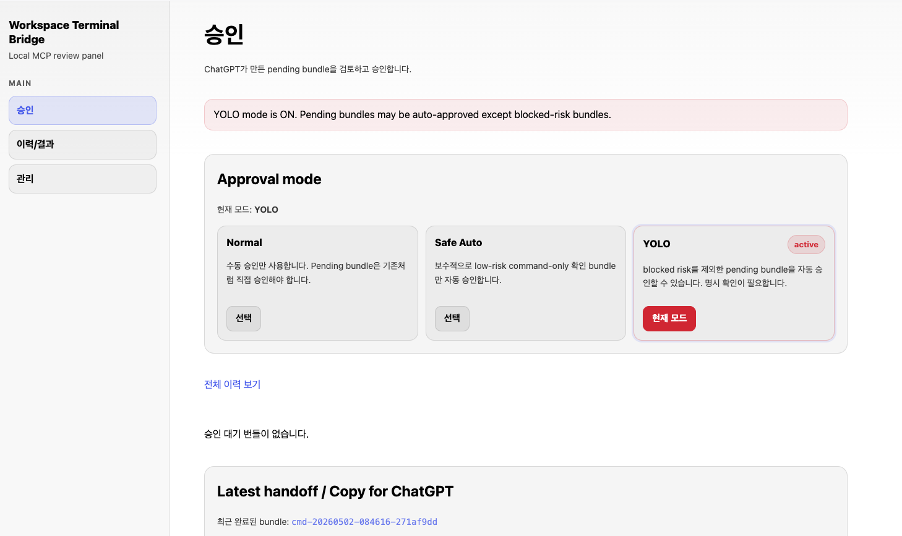

# Use the pending review UI

This guide explains the local review screen opened after `uv run terminalbridge start`.

```text
http://127.0.0.1:8790/pending
```



## Purpose

The pending review UI is where you review local work proposed by ChatGPT before it is applied.

```text
ChatGPT request
  -> Local MCP bridge
  -> Pending bundle
  -> User review
  -> Apply or skip
```

## Left navigation

| Menu | Purpose |
| --- | --- |
| Approval | Review current pending bundles. |
| History / Results | See past bundle results. |
| Manage | Check local server and session state. |

Most first-time users only need the **Approval** page.

## Storage cleanup

Use **Manage > Storage Cleanup** to inspect and prune runtime data that accumulates during long-running local use.

- Review runtime storage size and history counts.
- Tune retention counts and age thresholds.
- Preview cleanup candidates before applying cleanup.
- Run default cleanup or backup-inclusive cleanup.
- Clear eligible history through a guarded confirmation flow.

Pending bundles, session settings, secrets, and active pid files are preserved by cleanup actions.

## Approval mode

Start with **Normal** mode.

| Mode | Meaning |
| --- | --- |
| Normal | Manual review for every pending bundle. |
| Safe Auto | Conservative handling for simple low-risk command checks. |
| YOLO | Sends every valid pending bundle to the runner without manual approval. Use it only for trusted development sessions. |

YOLO is an **approval all-pass mode**. A pending bundle's `low`/`medium`/`high`/`blocked` risk or sensitive-path label no longer causes a manual approval prompt.

- Every newly created pending bundle is automatically submitted to the runner.
- Eligible YOLO bundles that were already pending before a review/watcher restart are resumed automatically.
- If a bundle JSON file is temporarily unreadable while it is still being written, the watcher retries it on a later poll instead of consuming it as a manual-review item.
- Runner path/command validation and actual command failures still fail the bundle. YOLO does not turn those execution failures back into approval prompts.

In other words, YOLO skips approval; it does not pretend that invalid paths, unexecutable commands, or failed processes succeeded.

If a red warning is shown, it means the approval stage is in all-pass mode. Switch back to **Normal** unless you intentionally changed it.

## Empty pending list

If the page says there are no pending bundles, that is usually normal. It means no new local work is waiting for review.

If you expected a bundle, check the session:

```bash
uv run terminalbridge status
```

Also confirm that the ChatGPT app is using the current MCP server URL.

## Before approving

Approve only work that matches your request. Check the files, commands, and scope. Reject anything unexpected or too large to review comfortably.

## First test

After connecting the app, try a harmless request first.

```text
Use this workspace directory: /path/to/your/project
Show me a brief overview of this directory's structure and tell me what kind of project it looks like.
```

When the expected bundle appears, inspect it in the review UI and approve it.

## Latest handoff / Copy for ChatGPT

This area shows the latest local result or text that can be copied back into ChatGPT. It is useful when continuing a longer workflow.

## Related docs

- [Quickstart](quickstart.md)
- [Connect as a ChatGPT custom app](chatgpt-app-setup.md)
- [Recommended local workflow](workflow.md)
- [Troubleshooting](troubleshooting.md)
