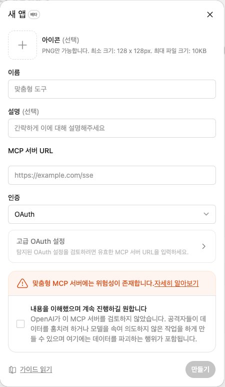

# ChatGPT 앱으로 연결하기

이 문서는 로컬에서 Ouroboros Workspace Bridge를 실행한 뒤, ChatGPT의 **새 앱** 화면에 어떤 값을 넣어야 하는지 설명합니다.



## 시작 전에

먼저 로컬 세션이 실행 중이어야 합니다.

```bash
uv sync
uv run woojae setup
uv run woojae start
```

`setup` 중에는 ChatGPT가 접근할 수 있는 `WORKSPACE_ROOT`와 기본 도움말 언어를 선택합니다. `NGROK_HOST`, `MCP_ACCESS_TOKEN`, `WOOJAE_HELP_LANG` 같은 기존 shell 환경값이 있으면 그 값을 우선 사용합니다.

실제 연결용 MCP URL은 다음 명령으로 복사하는 것을 권장합니다.

```bash
uv run woojae copy-url
```

미리보기만 확인하려면 다음 명령을 사용합니다.

```bash
uv run woojae mcp-url
```

`mcp-url`은 token을 가린 redacted preview일 수 있습니다. 실제 앱 생성 화면에는 `copy-url`로 복사한 실제 연결용 URL을 사용하세요.

## 각 항목에 넣을 값

| 화면 항목 | 넣을 값 | 설명 |
| --- | --- | --- |
| 아이콘 | 선택 사항 | 없어도 앱 생성은 가능합니다. 넣는다면 128x128 이상의 PNG를 권장합니다. |
| 이름 | `Ouroboros Workspace Bridge` | ChatGPT 앱 목록에 보이는 이름입니다. 짧게 `Ouroboros Bridge`로 써도 됩니다. |
| 설명 | `로컬 워크스페이스에서 파일 변경과 명령 실행을 승인 기반으로 연결하는 MCP 브리지` | 선택 사항이지만 나중에 앱을 구분하기 쉽게 넣는 것을 권장합니다. |
| MCP 서버 URL | `uv run woojae copy-url`로 복사한 URL | 직접 추측해서 입력하지 말고, 로컬 명령이 만든 실제 URL을 붙여넣으세요. |
| 인증 | 가능하면 `No auth`, `None`, `인증 없음`에 해당하는 옵션 | 이 bridge는 URL query string의 `access_token`으로 보호되는 흐름을 사용합니다. OAuth를 임의로 선택하지 마세요. |
| 고급 OAuth 설정 | 보통 비워둠 | 이 bridge를 OAuth 모드로 구성한 것이 아니라면 수정하지 않습니다. |
| 위험 경고 체크박스 | 내용을 이해한 뒤 체크 | 체크해야 `만들기` 버튼이 활성화됩니다. |
| 만들기 | 모든 필수값 입력 후 클릭 | 생성 후 connector를 refresh/reconnect하세요. |

## MCP 서버 URL

MCP 서버 URL은 가장 중요한 항목입니다. 보통 다음 형태입니다.

```text
https://<NGROK_HOST>/mcp?access_token=<TOKEN>
```

실제 token이 포함된 URL은 비밀값으로 취급하세요.

- GitHub issue에 붙여넣지 마세요.
- 문서나 스크린샷에 노출하지 마세요.
- 다른 사람과 공유하지 마세요.
- 연결이 끝난 뒤에도 터미널 출력이나 clipboard 기록 노출에 주의하세요.

`NGROK_HOST`가 설정되어 있지 않으면 temporary ngrok URL이 사용될 수 있습니다. temporary URL은 재시작 후 바뀔 수 있으므로 ChatGPT 앱의 MCP URL도 다시 수정해야 할 수 있습니다.

## 인증 선택

스크린샷에서는 `OAuth`가 기본값처럼 보일 수 있습니다. 하지만 이 bridge의 일반 연결 방식은 OAuth가 아니라 **token이 포함된 MCP URL**을 사용하는 방식입니다.

가능하면 인증 항목에서 다음 중 하나에 해당하는 옵션을 선택하세요.

- `No auth`
- `None`
- `인증 없음`
- direct URL 방식에 해당하는 항목

OAuth만 선택할 수 있거나 OAuth 설정을 반드시 요구한다면, 현재 ChatGPT UI가 direct MCP URL 연결을 허용하는 위치인지 다시 확인하세요. 임의의 OAuth 값을 채우면 연결이 실패할 수 있습니다.

## 위험 경고 체크박스

경고 문구는 custom MCP server가 데이터와 도구에 접근할 수 있다는 일반적인 주의입니다.

Ouroboros Workspace Bridge는 위험한 작업을 바로 실행하지 않고 다음 흐름을 사용합니다.

```text
ChatGPT 요청
  -> Local MCP bridge
  -> Pending bundle
  -> localhost review UI 승인
  -> 파일 변경 또는 명령 실행
```

그래도 신뢰할 수 있는 내 로컬 bridge에만 연결하고, review UI에서 예상한 bundle만 승인해야 합니다.

## 생성 후 확인

앱 생성 후 다음을 확인하세요.

```bash
uv run woojae status
```

로컬 review UI:

```text
http://127.0.0.1:8790/pending
```

처음 테스트할 때는 ChatGPT에게 위험하지 않은 확인 작업을 요청하세요.

예:

```text
현재 프로젝트의 git status만 확인해줘.
```

review UI에 예상한 command bundle이 올라오면 내용을 확인한 뒤 승인합니다.

## 자주 막히는 문제

### 만들기 버튼이 비활성화돼요

- 필수 항목인 이름과 MCP 서버 URL이 비어 있지 않은지 확인하세요.
- 위험 경고 체크박스를 체크했는지 확인하세요.
- URL이 `https://`로 시작하는지 확인하세요.

### 어떤 URL을 넣어야 할지 모르겠어요

직접 만들지 말고 다음 명령을 사용하세요.

```bash
uv run woojae copy-url
```

미리보기만 보고 싶다면:

```bash
uv run woojae mcp-url
```

### 인증에서 무엇을 골라야 하나요?

이 bridge의 일반 흐름은 URL에 포함된 `access_token`을 사용하는 방식입니다. 가능하면 `No auth` 또는 `인증 없음`에 해당하는 옵션을 선택하세요. OAuth는 임의로 설정하지 마세요.

### 연결은 됐는데 도구가 동작하지 않아요

다음을 확인하세요.

```bash
uv run woojae status
```

- `uv run woojae start`가 실행 중인지 확인합니다.
- ngrok URL이 바뀌지 않았는지 확인합니다.
- ChatGPT 앱의 MCP 서버 URL을 최신 URL로 갱신했는지 확인합니다.
- `http://127.0.0.1:8790/pending` 페이지가 열리는지 확인합니다.

## 관련 문서

- [빠른 시작](quickstart.md)
- [로컬 세션 운영](local-session.md)
- [문제 해결](troubleshooting.md)
