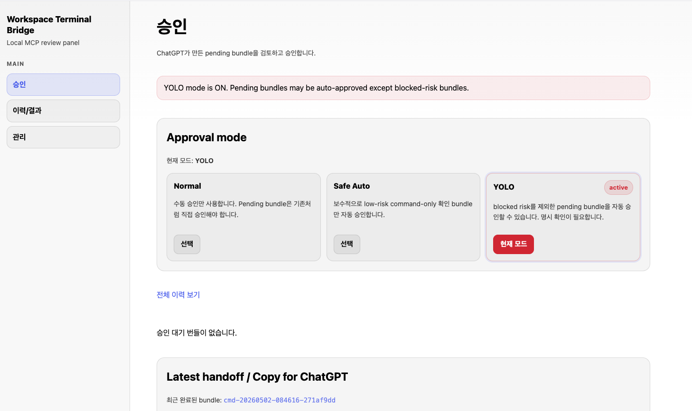

# pending review UI 사용하기

이 문서는 `uv run woojae start`로 로컬 세션을 시작한 뒤, 브라우저에서 여는 pending review UI를 사용하는 방법을 설명합니다.

```text
http://127.0.0.1:8790/pending
```



## 이 화면의 역할

pending review UI는 ChatGPT가 만든 file change 또는 command bundle을 바로 실행하지 않고, 사용자가 먼저 보고 승인하거나 거절할 수 있게 해주는 로컬 승인 화면입니다.

기본 흐름은 다음과 같습니다.

```text
ChatGPT 요청
  -> Local MCP bridge
  -> Pending bundle 생성
  -> pending review UI에서 확인
  -> 승인하면 실행
  -> 거절하면 실행하지 않음
```

## 왼쪽 메뉴

| 메뉴 | 역할 |
| --- | --- |
| 승인 | 현재 승인 대기 중인 pending bundle을 확인하고 승인/거절합니다. |
| 이력/결과 | 과거 bundle 처리 결과와 실행 이력을 확인합니다. |
| 관리 | 로컬 서버, 세션, 운영 상태를 확인합니다. |

처음 사용할 때는 대부분 **승인** 화면만 보면 됩니다.

## Approval mode

Approval mode는 pending bundle을 얼마나 자동으로 처리할지 정하는 설정입니다.

| 모드 | 설명 | 추천 상황 |
| --- | --- | --- |
| Normal | 모든 pending bundle을 사용자가 직접 승인합니다. | 처음 사용하는 사용자, 안전이 중요한 작업 |
| Safe Auto | 보수적으로 low-risk command-only 확인 bundle만 자동 승인될 수 있습니다. | 흐름에 익숙해진 뒤 반복 확인이 많을 때 |
| YOLO | blocked-risk를 제외한 pending bundle이 자동 승인될 수 있습니다. | 짧고 신뢰할 수 있는 세션에서만 임시 사용 |

처음 사용할 때는 **Normal**을 권장합니다.

YOLO는 빠르지만 위험합니다. 켜져 있으면 화면 상단에 다음과 같은 경고가 보일 수 있습니다.

```text
YOLO mode is ON. Pending bundles may be auto-approved except blocked-risk bundles.
```

이 메시지는 오류가 아니라 현재 승인 모드가 자동 승인에 가까운 위험한 상태라는 알림입니다. 의도한 상황이 아니라면 **Normal**로 되돌리세요.

## 승인 대기 번들이 없을 때

화면에 다음 문구가 보일 수 있습니다.

```text
승인 대기 번들이 없습니다.
```

이것은 보통 정상 상태입니다.

- 아직 ChatGPT가 작업을 요청하지 않았습니다.
- 이전 bundle이 이미 승인/거절/완료되었습니다.
- Safe Auto 또는 YOLO 모드에서 일부 bundle이 자동 처리되었습니다.

새 작업을 요청한 뒤에도 계속 비어 있다면 다음을 확인하세요.

```bash
uv run woojae status
```

그리고 ChatGPT 앱 연결 URL이 최신인지 확인하세요.

## bundle을 승인하기 전에 볼 것

승인 전에는 항상 아래를 확인하세요.

- 요청한 작업과 bundle 내용이 일치하는지
- 수정 파일이 예상한 파일인지
- 명령이 안전하고 필요한 명령인지
- 관련 없는 테스트, 커밋, push가 섞이지 않았는지
- token, `.env`, private file 내용이 포함되지 않았는지

예상과 다르면 승인하지 말고 거절하세요.

## 추천 첫 테스트

처음 연결한 뒤에는 위험하지 않은 확인 작업부터 요청하세요.

```text
작업할 디렉토리는 /path/to/your/project 입니다.
이 디렉토리의 구성을 간단히 보여주고, 어떤 종류의 프로젝트인지 요약해줘.
```

review UI에 `git status` 확인 bundle이 올라오면 내용을 확인한 뒤 승인합니다.

## Latest handoff / Copy for ChatGPT

화면 아래의 **Latest handoff / Copy for ChatGPT** 영역은 최근 완료된 bundle이나 다음 대화를 이어가기 위한 정보를 보여줍니다.

이 영역은 다음 상황에 유용합니다.

- 방금 처리한 bundle 결과를 ChatGPT에게 다시 전달할 때
- 로컬 실행 결과를 대화에 복사해야 할 때
- 작업 흐름을 중간에 이어갈 때

일반 사용자는 먼저 pending bundle 승인/거절 흐름에 익숙해진 뒤 사용하면 됩니다.

## 안전한 사용 순서

1. 처음에는 **Normal** 모드로 시작합니다.
2. ChatGPT에게 작은 작업을 요청합니다.
3. pending review UI에서 bundle 내용을 읽습니다.
4. 예상한 내용만 승인합니다.
5. 반복 확인이 많아지면 **Safe Auto**를 고려합니다.
6. **YOLO**는 짧고 신뢰할 수 있는 세션에서만 임시로 사용합니다.
7. 작업이 끝나면 필요하면 세션을 종료합니다.

```bash
uv run woojae stop
```

## 자주 막히는 문제

### 승인 대기 번들이 보이지 않아요

- `uv run woojae start`가 실행 중인지 확인하세요.
- ChatGPT 앱의 MCP 서버 URL이 최신인지 확인하세요.
- temporary ngrok URL을 쓰고 있다면 재시작 후 URL이 바뀌었을 수 있습니다.
- `uv run woojae status`로 review와 mcp 상태를 확인하세요.

### 빨간 경고가 보여요

YOLO 모드가 켜져 있을 가능성이 큽니다. 의도한 상황이 아니라면 Approval mode에서 **Normal**을 선택하세요.

### 무엇을 승인해도 되는지 모르겠어요

처음에는 작은 확인 명령만 승인하세요. 파일 수정, 테스트, 커밋, push가 한 bundle에 섞여 있으면 거절하는 편이 안전합니다.

## 관련 문서

- [빠른 시작](quickstart.md)
- [ChatGPT 앱으로 연결하기](chatgpt-app-setup.md)
- [권장 로컬 작업 흐름](workflow.md)
- [문제 해결](troubleshooting.md)
